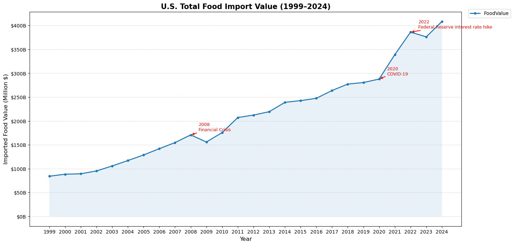
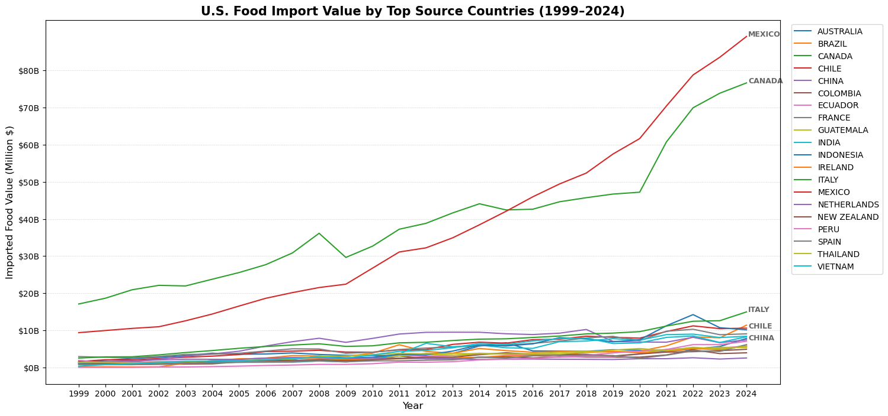
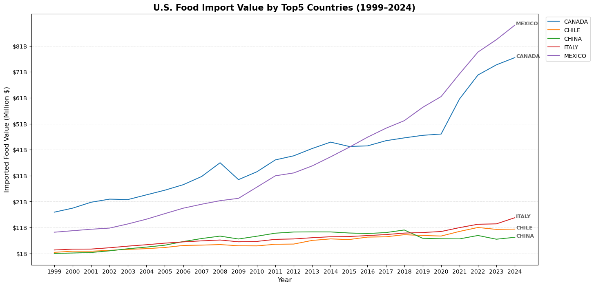
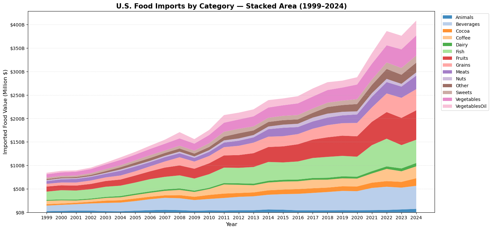
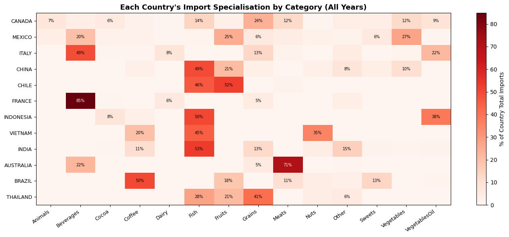
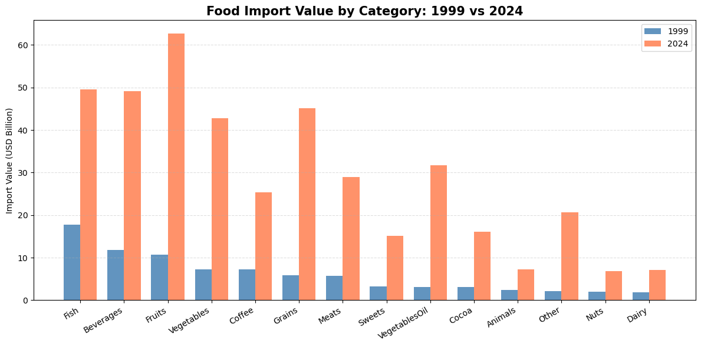

# U.S. Food Import Analysis (1999–2024)
A data analysis project exploring 25 years of U.S. food import trends across 14 food categories and major source countries, using Python for data processing and visualization.

## Project Overview
This project analyzes a dataset of 19,838 records sourced from the data.gov, covering U.S. food import values (in Million USD) from 1999 to 2024. The goal is to identify long-term structural trends, category-level growth patterns, and import specialization among top source countries.

## Key Findings
- U.S. total food import value grew nearly 5x from $85B (1999) to $400B (2024), with only a brief dip after the 2008 Financial Crisis and minimal disruption from COVID-19 in 2020
- VegetablesOil (9.7%) and Grains (8.5%) recorded the highest CAGR over 25 years, well above the average CAGR of 6.6%, while Fish (4.2%) and Animals (4.6%) grew the slowest
- Top source countries show distinct import specialization: France dominates in Beverages (85%), Australia in Meats (71%), Brazil in Coffee (50%), while Canada shows the most diversified supply structure
- Mexico and Canada are the largest source countries by total import value, with Mexico surpassing Canada after 2022

## Tech Stack
- Python 
- Pandas / NumPy
- Matplotlib / Seaborn

- Jupyter Notebook

## Sample Visualizations
## Sample Visualizations

### U.S. Total Food Import Value (1999–2024)



---

### Import Value by Country



---

### Top 5 Countries



---

### Category Composition (Stacked Area)



---

### Country Specialization



---

### Category Comparison (1999 vs 2024)



## Dataset
- Source: Data.gov
- Records: 19,838 entries
- Coverage: 1999–2024, 14 food categories, multiple countries
- Unit: Million USD

## Project Structure
```
US-Food-Import-Analysis/
├── US_Food_Import_Analysis.ipynb  
├── images/
│   ├── category_1999_vs_2024.png
│   ├── category_stacked_area.png
│   ├── country_specialization.png
│   ├── import_by_country.png
│   ├── top5_countries.png
│   ├── top5_countries_2.png
│   └── total_import.png
└── README.md
```

## How to Run
1. Clone the repository
````bash
git clone https://github.com/Jie-Hsu-D/US-Food-Import-Analysis.git
cd US-Food-Import-Analysis
````
2. Install required libraries
````bash
pip install pandas numpy matplotlib
````
4. Place `FoodImports.csv` in the same directory as the notebook
5. Open and run the notebook
````bash
jupyter notebook US_Food_Import_Analysis.ipynb
````
